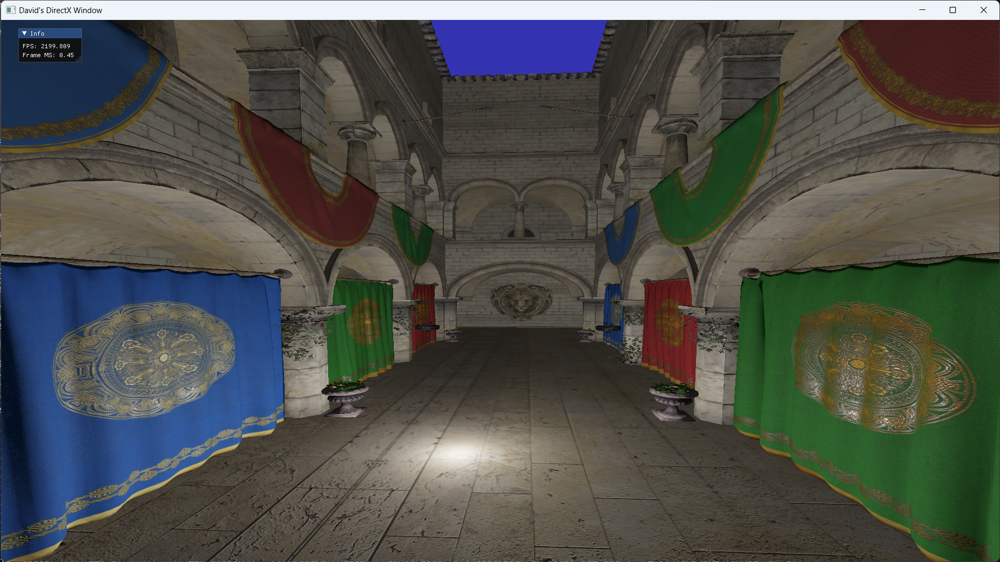
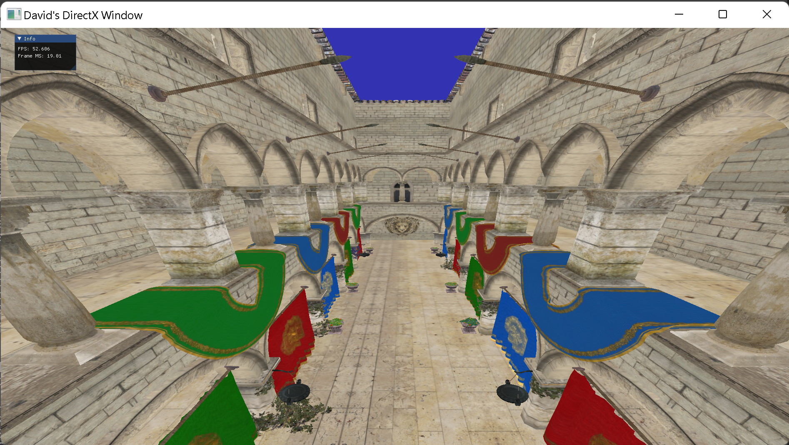

# DDX123

## Physically Based Rendering in [Sponza](https://github.com/KhronosGroup/glTF-Sample-Models/tree/master/2.0/Sponza) Scene - 3/10/23 

## Phong Shading / Normal Mapping in [Sponza](https://github.com/KhronosGroup/glTF-Sample-Models/tree/master/2.0/Sponza) Scene - 2/10/23 

## Mipmapping [Sponza](https://github.com/KhronosGroup/glTF-Sample-Models/tree/master/2.0/Sponza) Scene - 1/30/23 

## Loading [Sponza](https://github.com/KhronosGroup/glTF-Sample-Models/tree/master/2.0/Sponza) Scene - 1/25/23 

