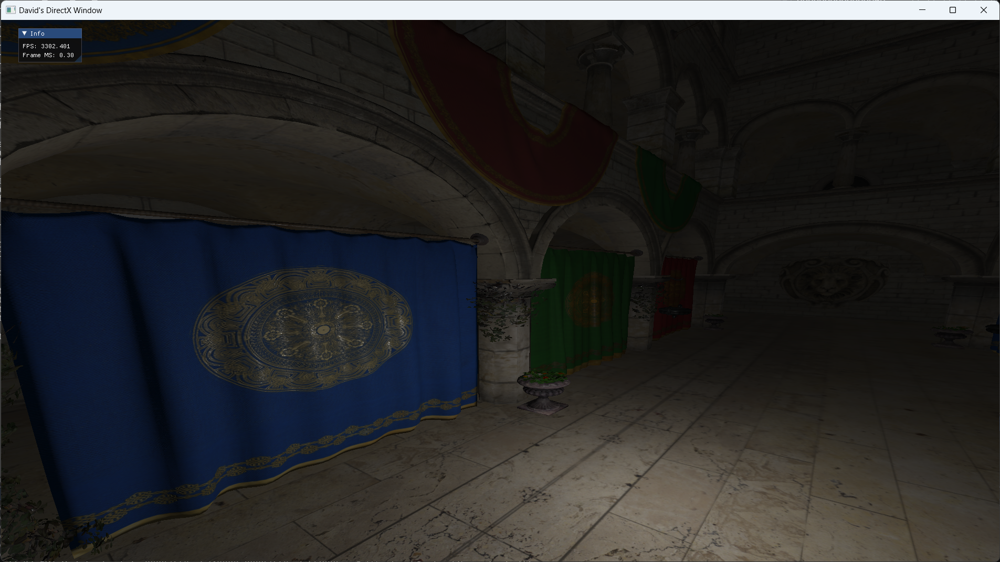
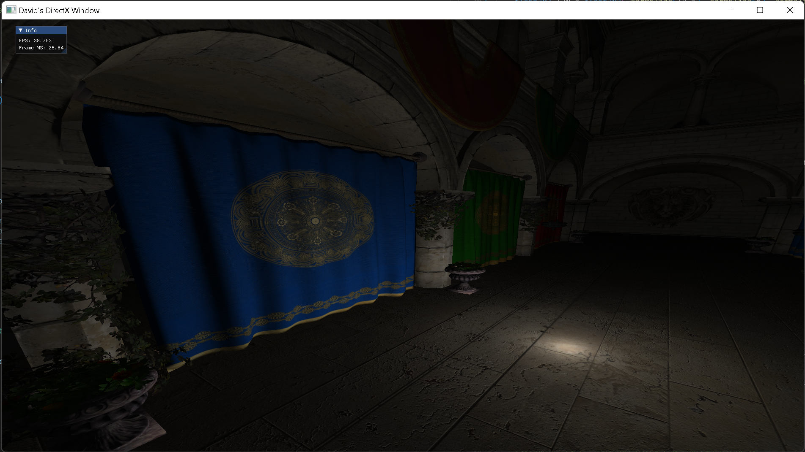

# DDX123

Toy renderer I use to learn about graphics programming.

To Build:
- Ensure git submodules are downloaded. `git submodule update --init`
- Ensure you're running in a Visual Studio Developer Command Prompt
- Build DirectXTex: `build.bat --DirectXTex2022` or `build.bat --DirectXTex2019` depending on your Visual Studio build tools version. Only needs to be done once.
- Build DDX123: `build.bat`
  - `build.bat -o`   - Optimized with cl flag: /O2
  - `build.bat -d`   - Debug build (Default)
  - `build.bat -rds` - Release build with debug symbols

## Shadow Maps in [Sponza](https://github.com/KhronosGroup/glTF-Sample-Models/tree/master/2.0/Sponza) Scene - 4/5/23 

## Physically Based Rendering in [Sponza](https://github.com/KhronosGroup/glTF-Sample-Models/tree/master/2.0/Sponza) Scene - 3/10/23 

## Phong Shading / Normal Mapping in [Sponza](https://github.com/KhronosGroup/glTF-Sample-Models/tree/master/2.0/Sponza) Scene - 2/10/23 

## Mipmapping [Sponza](https://github.com/KhronosGroup/glTF-Sample-Models/tree/master/2.0/Sponza) Scene - 1/30/23 

## Loading [Sponza](https://github.com/KhronosGroup/glTF-Sample-Models/tree/master/2.0/Sponza) Scene - 1/25/23 

